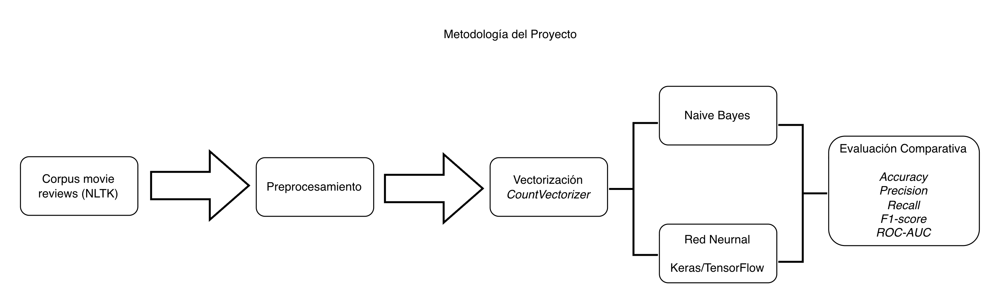

# Procesamiento del Lenguaje Natural (PLN)

# Clasificación de Sentimientos en Reseñas de Películas mediante Naive Bayes y Redes Neuronales

<p align="center">
  
</p>

---

## Descripción

Este proyecto desarrolla un sistema de clasificación automática de sentimientos utilizando técnicas de Procesamiento del Lenguaje Natural (PLN).

Se comparan dos enfoques ampliamente utilizados para la clasificación de texto:

- Multinomial Naive Bayes
- Red Neuronal implementada con TensorFlow/Keras

Ambos modelos fueron entrenados utilizando el corpus **movie_reviews** de NLTK y evaluados mediante diferentes métricas de desempeño para analizar sus fortalezas y limitaciones.

---

## Objetivos

- Implementar un clasificador basado en Naive Bayes.
- Diseñar una red neuronal sencilla utilizando Keras.
- Comparar objetivamente ambos modelos.
- Analizar los resultados mediante diferentes métricas.
- Comprender el impacto del preprocesamiento en tareas de PLN.

---

## Tecnologías utilizadas

- Python
- NLTK
- Scikit-learn
- TensorFlow / Keras
- Pandas
- NumPy
- Matplotlib

---

## Dataset

El proyecto utiliza el corpus **movie_reviews** incluido en la biblioteca NLTK.

Características principales:

- 2,000 reseñas
- Clasificación binaria
- 1,000 positivas
- 1,000 negativas
- Idioma inglés

---

## Metodología

El flujo general del proyecto comprende las siguientes etapas:

1. Carga del corpus.
2. Preprocesamiento del texto.
3. Vectorización mediante CountVectorizer.
4. Entrenamiento de Naive Bayes.
5. Entrenamiento de una Red Neuronal.
6. Evaluación comparativa mediante métricas y visualizaciones.

---

## Resultados

| Modelo | Accuracy | Precision | Recall | F1-score | ROC-AUC |
|---------|---------:|----------:|--------:|---------:|--------:|
| Naive Bayes | 0.8100 | 0.7925 | 0.8400 | 0.8155 | 0.8870 |
| Red Neuronal | **0.8275** | 0.7835 | **0.9050** | **0.8399** | **0.9175** |

La red neuronal obtuvo el mejor desempeño global, especialmente en Recall y ROC-AUC, mientras que Naive Bayes demostró ser una excelente línea base gracias a su simplicidad y eficiencia computacional.

---

## Estructura del repositorio

```text
.
├── docs/
│   ├── Proyecto_Final_PLN.pdf
│   └── Proyecto_Final_PLN.docx
│
├── images/
│   └── flujo_metodologico.png
│
├── notebook/
│   └── proyecto_final_pln.ipynb
│
├── README.md
├── LICENSE
└── requirements.txt
```

---

## Documentación

Este repositorio incluye distintos niveles de documentación para facilitar la comprensión y reproducción del proyecto.

| Recurso | Descripción |
|---------|-------------|
| 📓 Notebook | Implementación completa del proyecto |
| 📄 Informe PDF | Documento técnico completo |
| 📝 Informe Word | Versión editable del informe |

---

## Artículo en Medium

> Próximamente se publicará un artículo donde se describirá el desarrollo del proyecto, los principales aprendizajes y las conclusiones obtenidas durante la comparación entre Naive Bayes y una red neuronal sencilla.

---

## Cómo ejecutar

```bash
git clone https://github.com/alopez2003/nlp-sentiment-analysis-movie-reviews-by-alberto-lopez.git

cd nlp-sentiment-analysis-movie-reviews-by-alberto-lopez

pip install -r requirements.txt

jupyter notebook
```

---

## Autor

**Alberto López Gutiérrez**

Proyecto desarrollado como parte del **Postgrado en Inteligencia Artificial y Machine Learning** de **IEBS Digital School**.

## Profesora

** Layla Schelli**

